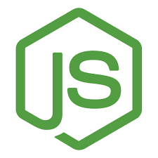
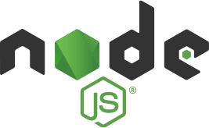

# Project 12: WTWR (What to Wear): Back End

## Description

The back-end project is focused on creating a server for the WTWR application. You’ll gain a deeper understanding of how to work with databases, set up security and testing, and deploy web applications on a remote machine. The eventual goal is to create a server with an API and user authorization.

### Technologies Used

- HTML
- Express.js
- Node.js
- MongoDB

---

 **HTML**

This project utilized general HTML.

 **Express.js**

Express.js was utilized to make a connection with MongoDB in order to facilitate the storing of information.

 **Node.js**

Node.js was used in this project.

 **MongoDB**

MongoDB was used in the project to store the information in a database.

- The project uses ES6 where possible.
- The code is well-formatted using the Prettier.

The following domains are associated with this project's backend as well as frontend:
- https://api.what2wear.minecraftnoob.com
- https://www.what2wear.minecraftnoob.com
- https://what2wear.minecraftnoob.com
